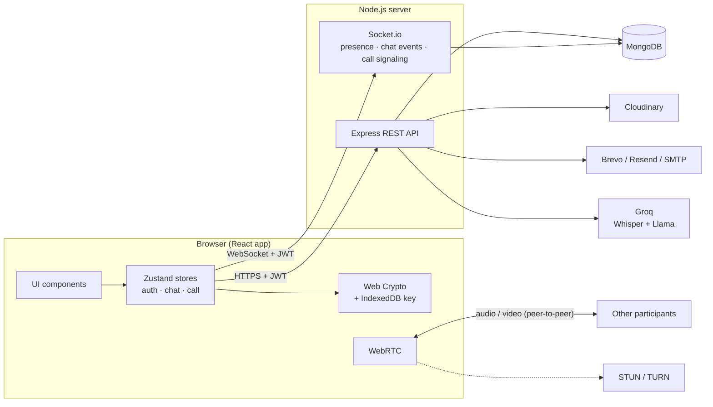
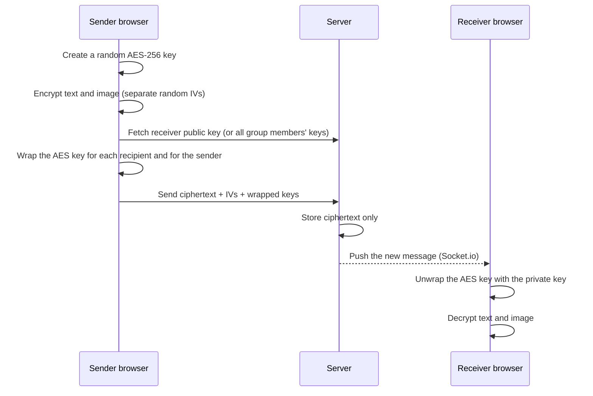
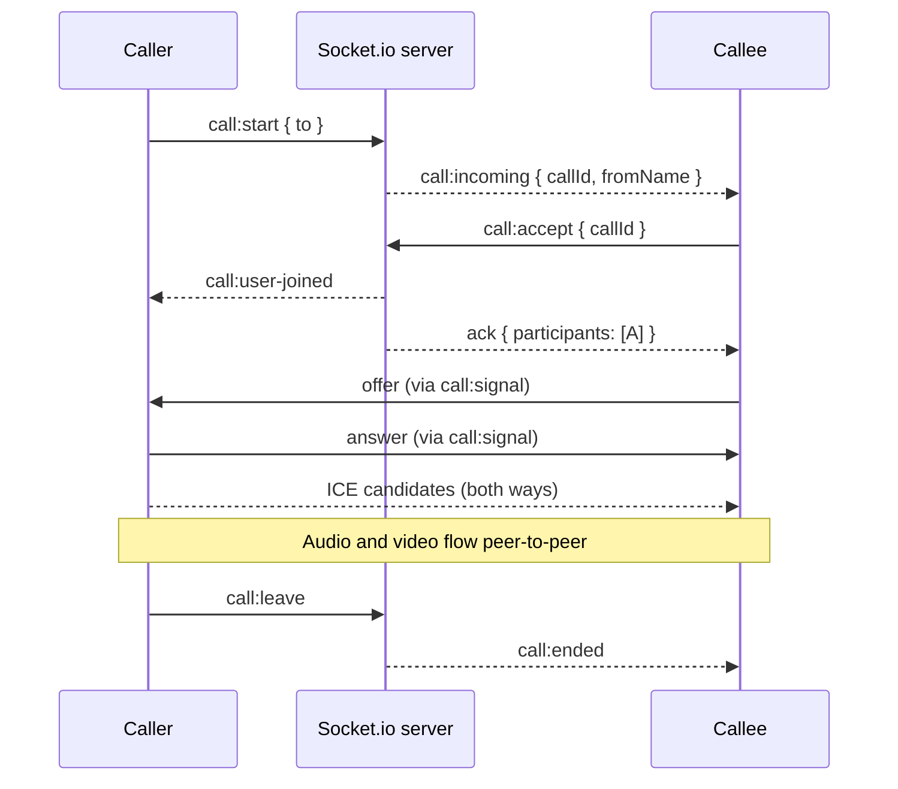

# Talkify

Talkify is a real-time chat application with end-to-end encrypted messaging, group chats, video calls and AI meeting summaries.

## Features

- **Private chats**: one-to-one messaging with text and images
- **Group chats**: create groups, add or remove members, leave or delete groups
- **End-to-end encryption**: messages and images are encrypted in the browser; the server only stores encrypted data
- **Video calls**: one-to-one and group video calls with mute and camera controls
- **AI meeting summary**: record call audio and get a short summary posted in the chat
- **Real-time updates**: new messages, online status and group changes appear instantly
- **Email login**: sign up and log in with a unique email address and password
- **Responsive design** for desktop and mobile

## Tech Stack

**Frontend**
- React 19 + Vite
- Zustand (state management)
- Tailwind CSS
- Socket.io Client
- WebRTC (video calls)
- Web Crypto API (encryption)

**Backend**
- Node.js + Express 5
- MongoDB + Mongoose
- Socket.io
- JWT authentication + bcrypt
- Cloudinary (image storage)
- Groq (speech-to-text and AI summaries)

## Architecture



**Request flow for a message**

1. The browser encrypts the message and sends ciphertext + wrapped keys to the REST API.
2. The API stores it in MongoDB and emits it over Socket.io to the sender's and receiver's rooms.
3. Each recipient's browser unwraps the AES key with its private key and decrypts the message.

## How End-to-End Encryption Works

### Keys

| Key | Algorithm | Where it lives |
| --- | --- | --- |
| Public key | RSA-OAEP 2048, SHA-256 | Server (readable by other users) |
| Private key (stored copy) | Encrypted with AES-256-GCM, key from PBKDF2-SHA256 (600k iterations, random salt) | Server (useless without the password) |
| Private key (active copy) | Non-extractable `CryptoKey` | Browser IndexedDB |
| Message key | AES-256-GCM, new for every message | Wrapped with RSA-OAEP for every recipient |

### Sending a message



### Important behaviour

- **Login:** the stored private key is decrypted with the password and imported as a non-extractable key. Keys made by older versions (10k PBKDF2 iterations) are upgraded automatically.
- **Locked keys:** if a user's keys were locked with an older password, they can create new keys at login.
- **Server view:** the server never sees plaintext messages, images or private keys.

## How Video Calls Work

The server keeps track of each active call (participants, invitees, ring timer). It relays connection details only between participants of the same call. Media flows peer-to-peer.



**Key details**

- **Group calls use a mesh.** A new participant opens a connection to everyone already in the call.
- **Negotiation** follows the WebRTC "perfect negotiation" pattern, so either side can safely renegotiate (for example when turning the camera on).
- **Quality:** capture is 1280×720 at 30 fps. Video bitrate is capped at 2.5 Mbps for two people and shared between peers in groups (minimum 400 kbps each). Audio is sent with high network priority.
- **Reliability:** ICE restarts after connection problems. A dropped socket has 15 seconds to reconnect and rejoin the call. Unanswered calls stop ringing after 45 seconds.
- **ICE servers** (STUN / TURN) are served by the backend from environment variables, so TURN credentials can change without rebuilding the frontend.

## Project Structure

```
Talkify/
├── backend/
│   ├── config/          # Database, CORS, Socket.io, Cloudinary, uploads
│   ├── controllers/     # Users, messages, groups, calls, meeting summary
│   ├── middleware/      # Authentication and rate limiting
│   ├── models/          # User, Message, Group, GroupMessage
│   ├── routes/          # API routes
│   └── index.js         # Server entry point
│
└── frontend/
    └── src/
        ├── components/  # Chat window, sidebar, video call screen, modals
        ├── pages/       # Login, Sign up, Chat dashboard
        ├── store/       # Auth, chat and call state
        ├── utils/       # Encryption helpers
        └── lib/         # API client
```

## Getting Started

### Prerequisites

- Node.js 18 or newer
- A MongoDB database (local or MongoDB Atlas)

### 1. Clone the repository

```bash
git clone https://github.com/prince1211-alt/Talkify.git
cd Talkify
```

### 2. Run the backend

```bash
cd backend
cp .env.example .env    # fill in your values
npm install
npm run dev
```

The backend runs on `http://localhost:5000`.

### 3. Run the frontend

```bash
cd frontend
npm install
npm run dev
```

The frontend runs on `http://localhost:5173`.

## Environment Variables

### Backend (`backend/.env`)

| Variable | Description |
| --- | --- |
| `MONGODB_URL` | MongoDB connection string |
| `JWT_SECRET` | Secret key for login tokens |
| `PORT` | Server port (default `5000`) |
| `NODE_ENV` | `development` or `production` |
| `FRONTEND_URL` | Frontend URL allowed to use the API (e.g. `https://your-app.vercel.app`) |
| `CLOUDINARY_CLOUD_NAME`, `CLOUDINARY_API_KEY`, `CLOUDINARY_API_SECRET` | Cloudinary account for images |
| `GROQ_API_KEY` | Groq API key for meeting summaries (optional) |
| `TURN_URLS`, `TURN_USERNAME`, `TURN_CREDENTIAL` | TURN server for calls on strict networks (optional) |

See `backend/.env.example` for the full list.

### Frontend (`frontend/.env`)

| Variable | Description |
| --- | --- |
| `VITE_BACKEND_URL` | Backend URL used in production (e.g. `https://your-backend.onrender.com`) |

## Deployment

**Separate frontend and backend (e.g. Vercel + Render)**

- Backend: root `backend`, build `npm install`, start `npm start`, set `NODE_ENV=production` and `FRONTEND_URL`
- Frontend: root `frontend`, build `npm run build`, output `dist`, set `VITE_BACKEND_URL`

**Single server**

Build the frontend, then start the backend with `NODE_ENV=production`. The backend serves the frontend from `frontend/dist`.

```bash
cd frontend && npm install && npm run build
cd ../backend && npm install && npm start
```

## REST API Reference

All routes are prefixed with `/api`. 🔒 = requires `Authorization: Bearer <token>`.

### Auth: `/api/auth`

| Method | Route | Description |
| --- | --- | --- |
| POST | `/signup` | Create an account with name, unique email and password (plus public key and encrypted private key) |
| POST | `/login` | Log in with email and password |
| POST | `/logout` | Clear the session cookie |
| GET | `/me` 🔒 | Current user profile |
| PUT | `/keys` 🔒 | Upgrade or replace encryption keys (needs current password) |
| POST | `/add-contact` 🔒 | Add a contact by email |

### Messages: `/api/messages`

| Method | Route | Description |
| --- | --- | --- |
| GET | `/users` 🔒 | Contact list |
| GET | `/keys/:id` 🔒 | A user's public key |
| GET | `/media?url=` 🔒 | Encrypted image fallback (only this app's Cloudinary raw files) |
| GET | `/:id` 🔒 | Conversation with a user |
| POST | `/send/:id` 🔒 | Send a message (JSON, or multipart with an encrypted `image`) |
| POST | `/:id/mark-read` 🔒 | Mark a conversation as read |
| DELETE | `/:id` 🔒 | Delete a message |

### Groups: `/api/groups`

| Method | Route | Description |
| --- | --- | --- |
| POST | `/create` 🔒 | Create a group |
| GET | `/my-groups` 🔒 | Groups the user belongs to |
| GET | `/:groupId/messages` 🔒 | Group messages (members only) |
| GET | `/:groupId/keys` 🔒 | Members' public keys (members only) |
| POST | `/:groupId/send` 🔒 | Send a group message |
| DELETE | `/:groupId/messages/:messageId` 🔒 | Delete a group message (sender or admin) |
| DELETE | `/:groupId` 🔒 | Delete the group (admin) |
| POST | `/:groupId/add` 🔒 | Add a member (admin) |
| DELETE | `/:groupId/remove/:memberId` 🔒 | Remove a member (admin) |
| POST | `/:groupId/leave` 🔒 | Leave the group |

### Calls and meetings

| Method | Route | Description |
| --- | --- | --- |
| GET | `/api/call/ice-servers` 🔒 | STUN / TURN configuration |
| POST | `/api/meeting/summarize` 🔒 | Upload call audio (`audio` field), returns transcript and summary |
| GET | `/api/health` | Health check |

## Socket.io Events

Connect with `io(BACKEND_URL, { auth: { token } })`. The server identifies the user from the token.

### Chat and presence (server → client)

| Event | Payload | Meaning |
| --- | --- | --- |
| `getOnlineUsers` | `userId[]` | Users currently online |
| `newMessage` | message | New private message |
| `newGroupMessage` | group message | New group message |
| `messageDeleted` | `{ messageId, chatType }` | A message was deleted |
| `contactAdded` | `{ user }` | Someone new started a chat with you |
| `addedToGroup` | group | You were added to a group |
| `removedFromGroup` / `leftGroup` | `{ groupId }` | You are no longer in a group |
| `groupUpdated` | `{ groupId, members, createdBy }` | Members or admin changed |
| `groupDeleted` | `groupId` | Group deleted |

Client → server: `joinGroup(groupId)` (members only) and `leaveGroup(groupId)`. The server also joins all of a user's group rooms on connect.

### Calls

| Direction | Event | Payload |
| --- | --- | --- |
| client → server | `call:start` | `{ to }` or `{ groupId }` (with ack) |
| client → server | `call:accept` / `call:reject` | `{ callId }` |
| client → server | `call:leave` | `{ callId }` |
| client → server | `call:rejoin` | `{ callId }` (after a reconnect, with ack) |
| both | `call:signal` | `{ callId, to / from, description?, candidate? }` |
| both | `call:media-state` | `{ callId, audio, video, recording }` |
| server → client | `call:incoming` | `{ callId, from, fromName, isGroup, groupId, groupName }` |
| server → client | `call:user-joined` / `call:user-left` | `{ callId, userId, name? }` |
| server → client | `call:declined` | `{ callId, userId, name }` (group calls) |
| server → client | `call:ended` | `{ callId, reason: ended \| rejected \| no-answer }` |
| server → client | `call:cancelled` | `{ callId, reason }` (stop ringing) |

## Security

| Area | Protection |
| --- | --- |
| Message privacy | End-to-end encryption for text and images; server stores ciphertext only |
| Key storage | Password-encrypted private key on the server; non-extractable key in the browser |
| Passwords | bcrypt hashing; minimum 6 characters |
| Sessions | JWT (HS256, 24 h) |
| Cross-site access | Origin allowlist on the API and on Socket.io (including WebSocket upgrades) |
| Socket identity | Socket.io connections authenticated with the JWT; user ID never taken from the client |
| Call signaling | Relayed only between participants of the same call |
| Injection | Mongoose `sanitizeFilter` plus string-only input handling |
| Data exposure | Contact and member lists contain public profile fields only |
| Brute force | Rate limits on login, signup and key-update routes |
| Uploads | Size limits and file-type checks; call recordings are deleted right after processing |
| Recording consent | All participants see a notice and a "REC" badge while audio is recorded |

## Scripts

| Folder | Command | Description |
| --- | --- | --- |
| backend | `npm run dev` | Start the server with auto-reload |
| backend | `npm start` | Start the server |
| frontend | `npm run dev` | Start the development server |
| frontend | `npm run build` | Build for production |
| frontend | `npm run lint` | Check code with ESLint |

## Author

[prince1211-alt](https://github.com/prince1211-alt)
